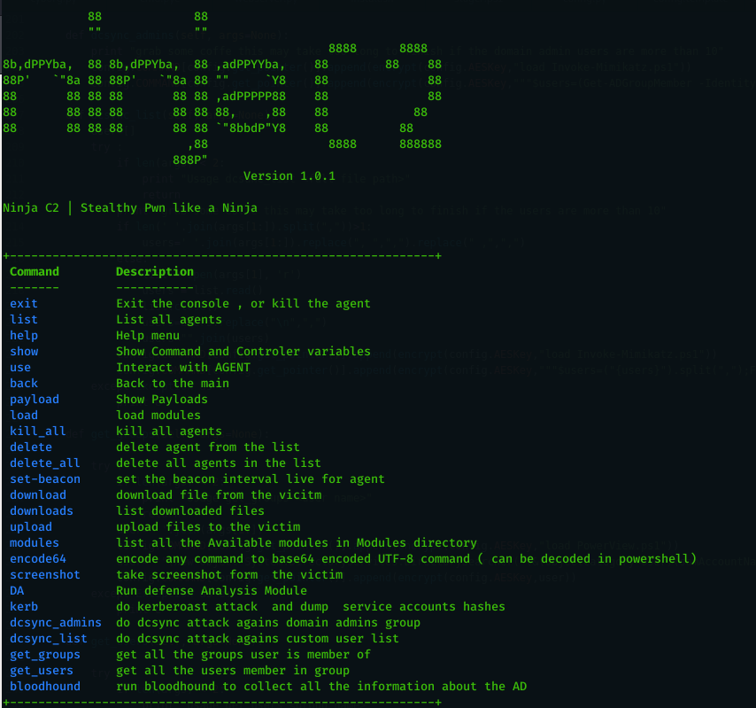
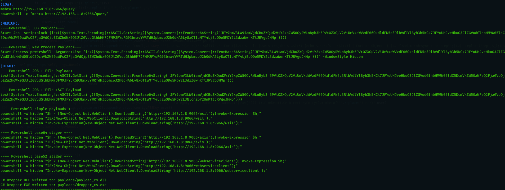
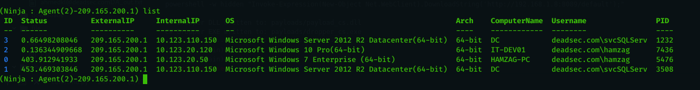
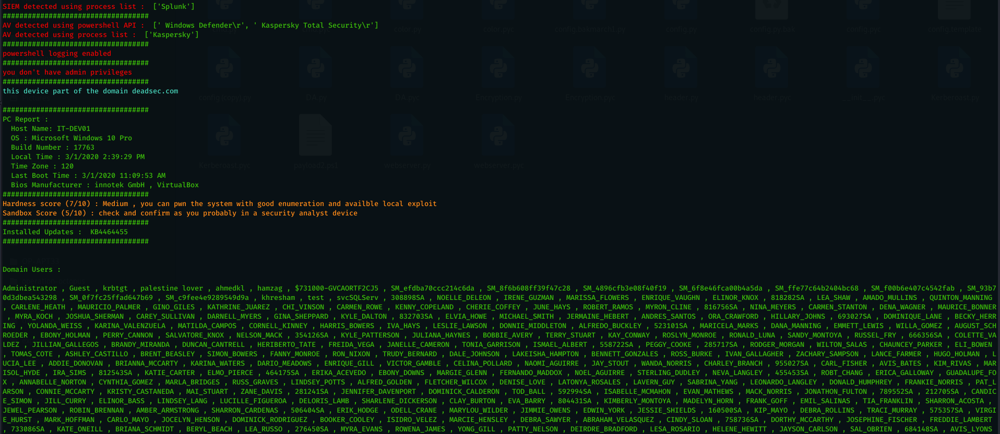
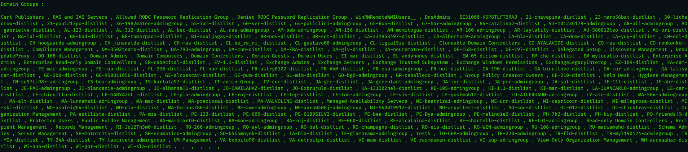
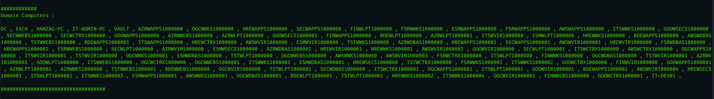
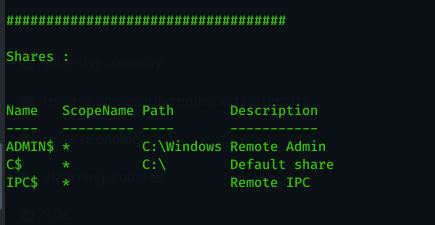
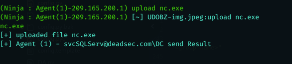
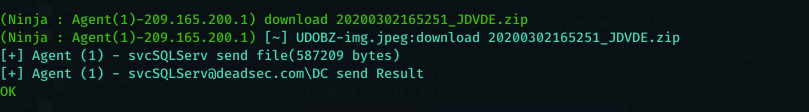

# What is Ninja ?

   Ninja C2 is an Open source C2 server created by Purple Team to do stealthy computer and Active directoty enumeration without being detected by SIEM and AVs , Ninja still in beta version and when the stable version released it will contains many more stealthy techinques and anti-forensic to create a real challenge for blue team to make sure all the defenses configured correctly and they can detect sophisticated attacks.

  Ninja use python to server the payload and control the agents . the agents are based on C# and powershell which can bypass leading AVs . Ninja comunicate with the agents in secure channel encrpyted with AES-256 and the key is not hard coded but randomly generated on the campaign start , every agent connect to the C2 get the key and if the C2 restarted a new key will be used by all old agents and the new. Ninja also randomize the callback URLs for every campaign to bypass static detection.

  1) The main feature in Ninja is called DA ( Defense Analysis ), which will do the required enumeration to get below important information and do analysis on them to get score for system defenses and sandbox detection .
  2) Detect SIEM solutions : right now it detect SPlUNK , Log beat collector ,  sysmon.
  3) detect AV using two ways , using powershell command and using processes.
  4) check if the powershell logging enabled
  5) check if the user have admin privileges
  6) provide information about system : host name , OS , build number , local time , time zone , last boot and bios .
  7) provide information about the installed security updates.
  8) provide a System pwn hardness score based on multiple factors.
  9) provide a sandbox detection score based on ( privileges , bios manufacturer , joined to domain  or  not ,  existence of  sysinternals processes ).
 10) show all domain  users ( using powershell commands ).
 11) show all domain groups ( using powershell commands ) .
 12) show all domain computers  ( using powerview.ps1 - taken from : https://github.com/PowerShellEmpire/PowerTools/blob/master/PowerView/powerview.ps1 ).
 13) show available shares.


  Ninja is designed to be easy to setup and to add more commands and do automation for boring tasks. you can find many short commands that a red teamer struggle to memorize and search for them. please check this article to know more about ninja : https://shells.systems/introducing-ninja-c2-the-c2-built-for-stealth-red-team-operations/


  # Ninja key features
  Ninja is packed with a number of features that allows you to gain an insight into your upcoming engagement before you actually need to deploy your full aresenal or tools and techniques, such as:


* Defense Analysis
* automation for kerberoast attack from generating the kerberos tickets to extracting the SPN hashes into hashcat format.
* automation for dc_sync to get hashes for a list of users or domain admin group.
* Undetected Automation to get groups the user belong to and the users member in a group.
* Automation for bloodhound AD data collection .
* customized c# payloads that encrypt strings to bypass static detection.
* encode any command you want to unicode base64 to be used in powershell encoded commands.
* full encryption of all communications between Agent and command and control to bypass AV and IPS detection.
* dynamic URLs for all function , just place your list of url names and the c2 will use it randomly to bypass any static detection.
* get random encryption key on the fly ( not hard coded ) every time the agent connect ( even reconnection needs a new key )
* take screenshots and send it encrypted to C2
* upload files from C2 to victim encrypted to bypass AV and IPS
* download files from the victim encrypted to bypass AV and IPS
* staged payloads to bypass detection ( base64 and base52 )
* bypasses AVs ( tested on kaspersky and trendmicro )
* Bypasses SIEM detection ( tested on splunk collecting usual event logs along with sysmon logs ) not tested on powershell v5 script block and module logging ( will be done in the next release ).
* set the beacon interval dynamically even after the agent connected and provide a starting beacon interval in the campaign start configurations
* logging for all commands and results in order to return to any data you missed in your operation.
* set the configuration one time when you start the campaign and enjoy.
* global kill switch to end campaigns.
* delete table entries.
* all the payload written to payloads folder for easy access and further customization.
* easy to add automation for any command you want.

# Requirement

please note that compling C# depends on the `System.Management.Automation.dll` assembly with SHA1 hash c669667bb4d7870bc8bb65365d30071eb7fb86fe.

Some Ninja Commands require below modules ( already exist in modules ) which you need to get updates from their repo :

Invoke-Kerberoast : https://raw.githubusercontent.com/xan7r/kerberoast/master/autokerberoast.ps1

Invoke-Mimikatz   : https://github.com/PowerShellMafia/PowerSploit/blob/master/Exfiltration/Invoke-Mimikatz.ps1

Sharphound        : https://github.com/BloodHoundAD/BloodHound/blob/master/Ingestors/SharpHound.ps1

PowerView         : https://github.com/PowerShellEmpire/PowerTools/blob/master/PowerView/powerview.ps1


# Installation

First of all make sure to download the latest version of Ninja using the following command :

```git clone https://github.com/ahmedkhlief/Ninja/```

You need to setup Ninja by running install.sh script :

```chmod +x ./install.sh```
```sudo ./install.sh```


After that you need to initialize the campagin :

`python start_campaign.py`

Now you can start the Ninja server  :

`python Ninja.py`

You will by greeted with the following once you run it :

```


            88             88             
            ""             ""                           
                                              88888      8888
8b,dPPYba,  88 8b,dPPYba,  88 ,adPPYYba,    88        88    88
88P'   `"8a 88 88P'   `"8a 88 ""     `Y8    88              88
88       88 88 88       88 88 ,adPPPPP88    88              88
88       88 88 88       88 88 88,    ,88    88            88
88       88 88 88       88 88 `"8bbdP"Y8    88          88  
                          ,88                 88888      888888
                        888P" 		      
					    V1.0.1 BETA !


 Ninja C2 | Stealthy Pwn like a Ninja

+------------------------------------------------------------+
 Command        Description                                                                        
 -------        -----------                                                                        
 exit           Exit the console , or kill the agent                                               
 list           List all agents                                                                    
 help           Help menu                                                                          
 show           Show Command and Controler variables                                               
 use            Interact with AGENT                                                                
 back           Back to the main                                                                   
 payload        Show Payloads                                                                      
 load           load modules                                                                       
 kill_all       kill all agents                                                                    
 delete         delete agent from the list                                                         
 delete_all     delete all agents in the list                                                      
 set-beacon     set the beacon interval live for agent                                             
 download       download file from the vicitm                                                      
 downloads      list downloaded files                                                              
 upload         upload files to the victim                                                         
 modules        list all the Available modules in Modules directory                                
 encode64       encode any command to base64 encoded UTF-8 command ( can be decoded in powershell)
 screenshot     take screenshot form  the victim                                                   
 DA             Run defense Analysis Module                                                        
 kerb           do kerberoast attack  and dump  service accounts hashes                            
 dcsync_admins  do dcsync attack agains domain admins group                                        
 dcsync_list    do dcsync attack agains custom user list                                           
 get_groups     get all the groups user is member of                                               
 get_users      get all the users member in group                                                  
 bloodhound     run bloodhound to collect all the information about the AD                 
+------------------------------------------------------------+


```
# Usage

Please check this article about Ninja and how to use it : https://shells.systems/introducing-ninja-c2-the-c2-built-for-stealth-red-team-operations/.


# Todo
* [ ] Enhance DA module and add more SIEM , AV and sandbox detection along with more important eenumeration data.
* [ ] more focus on stealth to load agent parts only when needed
* [ ] add more shortend commands for popular modules
* [ ] add more customizations and ideas for phishing using C# payloads and macros
* [ ] integration with curveball exploit
* [ ] integration with new exchange RCE
* [ ] Undetectable Persistence
* [ ] create a wipe command to securly remove files on hard disk without being detected and analyzed by blue team.
* [ ] make the agent blocks changes randomly to bypass any static detection
* [ ] add obfuscation for the agents.
* [ ] integrate cobalt strike payloads


# Screenshots
Main Screen

* * * *
Payloads

* * * *
Agent List

* * * *
DA

* * * *
DA

* * * *
DA

* * * *
DA


* * * *
Upload file


* * * *
Download File

* * * *

# License

This project is licensed under the GPL-3.0 License - see the LICENSE file for details
